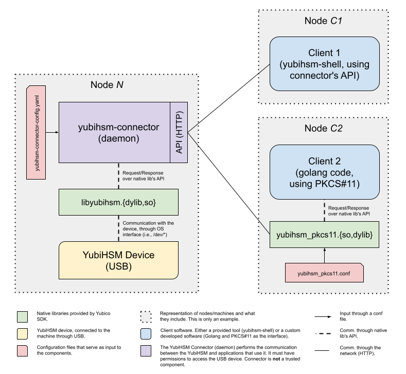

# Go example for YubiHSM2 FIPS

This repo lays the groundwork for setting up and interacting with the [YubiHSM2 FIPS](https://www.yubico.com/products/hardware-security-module/) using [Golang](https://go.dev/). It also documents architectural trade-offs and technical challenges.

 ## What the heck is an HSM?

A Hardware Security Module (HSM) is a physical computing device that safeguards and manages digital keys for strong authentication and provides crypto-processing. HSM traditionally comes in the form of a plug-in cards or an external device that attaches directly to a computer or network server.

The main purpose of an HSM is to secure cryptographic keys and operations within the device, offering a higher level of security than software-based management because the keys are less susceptible to theft or unauthorized access.

👉 HSMs are specifically designed to protect the lifecycle of cryptographic keys. Their tamper-resistant physical design ensures that sensitive keys are never exposed outside the module.

👉 [FIPS](https://en.wikipedia.org/wiki/Federal_Information_Processing_Standards) (Federal Information Processing Standards) is developed by [NIST](https://www.nist.gov) (National Institute of Standards and Technology), part of the [U.S. Department of Commerce](https://www.commerce.gov). FIPS standards are issued to establish requirements for various purposes, such as ensuring computer security and interoperability.

👉 [YubiHSM2 FIPS](https://www.yubico.com/products/hardware-security-module/) product is certified with [FIPS 140-2, Level 3](https://en.wikipedia.org/wiki/FIPS_140-2).

## Install dependencies

First, install the `yubihsm2-sdk`.

You can fetch the SDK package, including all tools, from here: https://developers.yubico.com/YubiHSM2/Releases/

### MacOS

To install (`brew`):

```shell
brew install yubihsm2-sdk
```

If you don't know where the `yubihsm_pkcs11.dylib` is located, you can use:

```shell
sudo find /usr -name "yubihsm_*.dylib" -print
```

### Linux (Ubuntu)

Visit the [SDK release website](https://developers.yubico.com/YubiHSM2/Releases/) and select the package that is aligned to your Linux distro and version. For example, for Ubuntu 22.04, choose the file [`yubihsm2-sdk-2023-11-ubuntu2204-amd64.tar.gz`](https://developers.yubico.com/YubiHSM2/Releases/yubihsm2-sdk-2023-11-ubuntu2204-amd64.tar.gz).

After downloading, extract it:

```shell
tar -xvzf yubihsm2-sdk-2023-11-ubuntu2204-amd64.tar.gz
cd yubihsm2-sdk
```

To install:

```
apt --fix-broken -y install $(ls ./*.deb | grep -v './libyubihsm-dev')
```

This command installs all `*.deb` files except the `libyubihsm-dev` one, which is not strictly necessary.

You might need to add a `udev` rule. Create the file `/etc/udev/rules.d/` and add the following content:

```conf
# This udev file should be used with udev 188 and newer
ACTION!="add|change", GOTO="yubihsm2_connector_end"

# Yubico YubiHSM 2
# The OWNER attribute here has to match the uid of the process running the Connector
SUBSYSTEM=="usb", ATTRS{idVendor}=="1050", ATTRS{idProduct}=="0030", OWNER="yubihsm-connector"

LABEL="yubihsm2_connector_end"
```

## Architecture

To better understand the role of all components and how they communicate, the following picture depicts a high-level architecture.



Important points:

* The logical representation of nodes (i.e., machines) is just an example. All components placed within `Node N`, `Node C1`, and `Node C2`, can be on a single node/machine. The separation between 3 different nodes is just for clarity -- highlighting that `Client 2` doesn't require, e.g., `yubihsm-shell`, and that `Client 1` doesn't need, e.g., `yubihsm_pkcs11.so`, and so on.
* The native libraries (green), the connector (purple), and `Client 1` (blue) are included in the [YubiHSM2 SDK](https://developers.yubico.com/YubiHSM2/Releases/).
* An advantage of using the [PKCS#11 standard](https://en.wikipedia.org/wiki/PKCS_11) to communicate with an HSM is interoperability. Therefore, it doesn't matter what exactly is behind the PKCS#11 interface since it can be easily replaced without affecting the application implementation.

## YubiHSM Connector

From the developer portal at Yubico website:

> The Connector is not a trusted component. Sessions are established cryptographically between the application and the YubiHSM 2 using a symmetric mutual authentication scheme that is both encrypted and authenticated.

An important aspect about connectivity, also highlighted at the Yubico developer's website:

> The Connector is not required to run on the same host as the applications which access it. In that case the Connector should be configured to be listening on a different address and port rather than the default localhost:12345, making sure that the client has access.

To install:

```shell
yubihsm-connector install
```

Then, start it:

```shell
sudo yubihsm-connector --config yubihsm-connector-config.yaml start
```

Check if the `yubihsm-connector` is running successfully using `curl`:

```shell
curl -v http://localhost:12345/connector/status
```

You should see something like this, with a `HTTP 200` response:

```conf
status=OK
serial=*
version=3.0.4
pid=10276
address=localhost
port=12345
```

## Useful commands

* Start the `yubihsm-shell` (interactive mode):

  ```shell
  yubihsm-shell
  ```

  Connect and create a session:

  ```
  yubihsm> connect
  Session keepalive set up to run every 15 seconds
  yubihsm> session open 1 password
  Created session 0
  ```

  Then, for example, list all objects:

  ```
  yubihsm> list objects 0
  Found 1 object(s)
  id: 0x0001, type: authentication-key, algo: aes128-yubico-authentication, sequence: 0, label: DEFAULT AUTHKEY CHANGE THIS ASAP
  ```

* You might want to run the `yubihsm-shell` non-interactively, specifying actions directly in the command line:

  ```shell
  yubihsm-shell --authkey=1 --password=password --outformat=hex --action=list-objects
  ```

## Scenario for Key Setup

Imagine that you just bought the YubiHSM2 FIPS and want to set-up the following:

- Generate an asymmetric key (secp256r1) that will never leave the HSM
- Enable this key to sign data

> 🚨**IMPORTANT**🚨: it'd save lots of time if you read [Core Concepts](https://docs.yubico.com/hardware/yubihsm-2/hsm-2-user-guide/hsm2-core-concepts.html) before starting. Make sure you understand what an [Object](https://docs.yubico.com/hardware/yubihsm-2/hsm-2-user-guide/hsm2-core-concepts.html#object-id), [Capability](https://docs.yubico.com/hardware/yubihsm-2/hsm-2-user-guide/hsm2-core-concepts.html#capability) (including "Delegated Capabilities"), and [Domain](https://docs.yubico.com/hardware/yubihsm-2/hsm-2-user-guide/hsm2-core-concepts.html#domain) are.

### Setting up a new Authentication Key

Set up a new auth key:

```shell
yubihsm-shell --authkey 1 --password password --outformat base64 -a put-authentication-key -i 0x0002 -l hsm-go-test -d 2 -c generate-asymmetric-key,export-wrapped,get-pseudo-random,put-wrap-key,import-wrapped,delete-asymmetric-key,sign-ecdsa --delegated sign-ecdsa,exportable-under-wrap,export-wrapped,import-wrapped --new-password newpassword123
```

Details:
* `-i 0x0002`: we're setting the identifier of the object to `0x0002`. If you leave the `-i` param as `0`, a new one will be automatically assigned.
* `-d 2`: indicates this authentication key is only valid in domain `2`.

> 🚨**IMPORTANT**🚨: delete the default authentication key (id: 0x0001) when configuring productive environments.

### Generate a Key for Signing

Generate the key (`ecdsa`, `secp256r1`):

```shell
yubihsm-shell --authkey 2 --password newpassword123 --outformat base64 -a generate-asymmetric-key -i 0 -l hsm-go-test-key1 -d 2 -c sign-ecdsa -A ecp256
```

Returns:

```
Generated Asymmetric key 0x13db
```

List all the objects (to check if the key was created):

```shell
yubihsm-shell --authkey 2 --password newpassword123 --outformat base64 -a list-objects
```

Sign the data from the `data.txt` file (and output the signature to `signature.b64` file):

```shell
cat data.txt | yubihsm-shell --authkey 2 --password newpassword123 --outformat base64 -a sign-ecdsa -i 0x13db -A ecdsa-sha256
```

Get the public key (and output result to the `asymmetric_key.pub` file):

```shell
yubihsm-shell --authkey 2 --password newpassword123 --outformat base64 -a get-public-key -i 0x13db > asymmetric_key.pub
```

Convert the `signature.b64` file to a binary format using `base64` command-line tool, and output the result to the `signature.bin` file:

  * If you're on MacOS:
  
    ```shell
    base64 -d -i signature.b64 > signature.bin
    ```

  * If you're on Linux:

    ```shell
    base64 -d signature.b64 > signature.bin
    ```

Verify the signature (from `signature.bin` file) using `openssl`:

```shell
openssl dgst -sha256 -signature signature.bin -verify asymmetric_key.pub data.txt
```

## Signing using the Golang code

Ensure you review the `.env.template` and the `const` section of the `main.go` file. To change any default values, the easiest approach is to create a `.env` file and override the variables you need. All other values will use the defaults.

The Golang example code uses the [PKCS#11 standard](https://en.wikipedia.org/wiki/PKCS_11).

Run:

```shell
go run main.go
```

In summary, here's what `main.go` does:
- Lists all objects (keys)
- Fetches the private key object (i.e., object identifier)
- Tests whether the private key value can be fetched (nooooo! 😅)
- Fetches the public key object (i.e., object identifier)
- Prints the public key (in hex and base64)
- Requests a signature from the HSM (using `data.txt` file)
- Prints the signature (in hex and base64)
- Prints the curve based on the public key
- Verifies the signature based on the public key ✅ 🥳

> 🚨**IMPORTANT**🚨:
> DO NOT USE THIS CODE IN PRODUCTION. PLEASE.
> This is just an example and was created in the "quick and dirty" mode. 😅

## TODOs

- [ ] Clarify the optimal setup in terms of auth key, audit key, and wrap key. A superior setup might involve having 3 keys with distinct roles.
- [ ] Determine the best approach for setting up the wrap key and managing backups.
- [ ] Create a Docker image containing all the tools from the YubiHSM SDK.

## Acknowledgements and References

Parts of this README were heavily inspired and based on the [user guide](https://docs.yubico.com/hardware/yubihsm-2/hsm-2-user-guide/hsm2-quick-start.html) provided by Yubico. Their documentation is exceptionally well-written. Rewriting some of the steps, which are scattered throughout their documentation, helped me better understand and clarify the details. I hope it does the same for you. 😉

While this project was pursued during my free time, I'd like to extend special thanks to [AxLabs](https://axlabs.com) and [NGD](https://neo.org) for providing me with the opportunity to experiment with the YubiHSM2 FIPS hardware. 🙏🥳